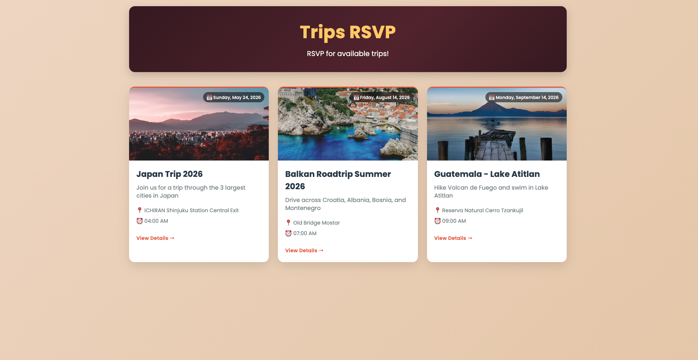
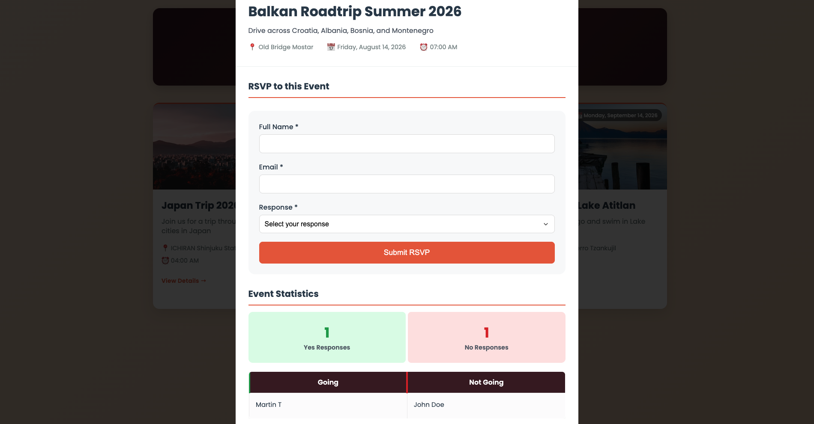

# Trips RSVP ✈️

A full-stack trip RSVP app built to learn and practice core AWS services. Users can browse upcoming trips, submit an RSVP, and see live attendance stats.

## AWS Stack

| Service | Role |
|---|---|
| **Lambda** | Backend logic — handles RSVP submissions and data fetching |
| **API Gateway** | Exposes Lambda as REST endpoints for the frontend |
| **DynamoDB** | Stores RSVP responses |
| **RDS** | Stores event data (trips) |
| **S3** | Hosts the static frontend (HTML, CSS, JS) |
| **CloudFront** | CDN in front of S3 for fast global delivery |

## Frontend

Vanilla HTML/CSS/JS — no framework. Calls API Gateway directly via `fetch`.
